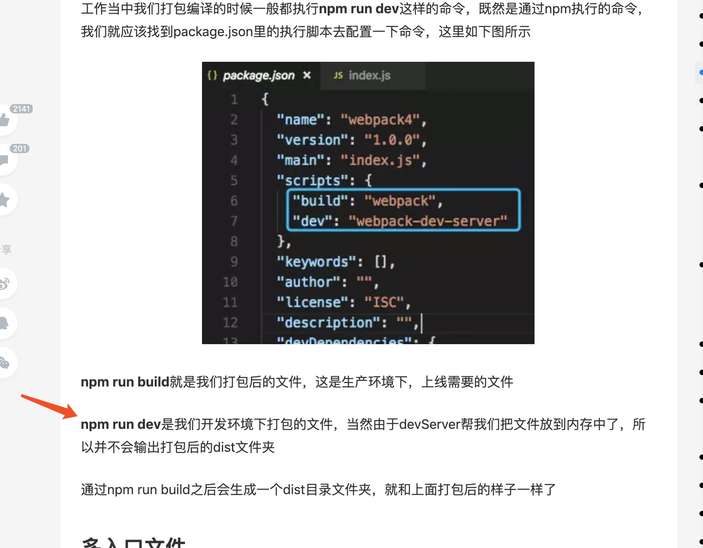

npm run build 会生成 dist 文件目录，对应打包的文件。

npm run dev 不会生成额外文件，会启动 webpack-dev-server,相应的代码会读进内存，不会在当前目录下生成 dist 文件夹。

npm run build 就是我们打包后的文件，这是生产环境下，上线需要的文件

npm run dev 是我们开发环境下打包的文件，当然由于 devServer 帮我们把文件放到内存中了，所以并不会输出打包后的 dist 文件夹

  

